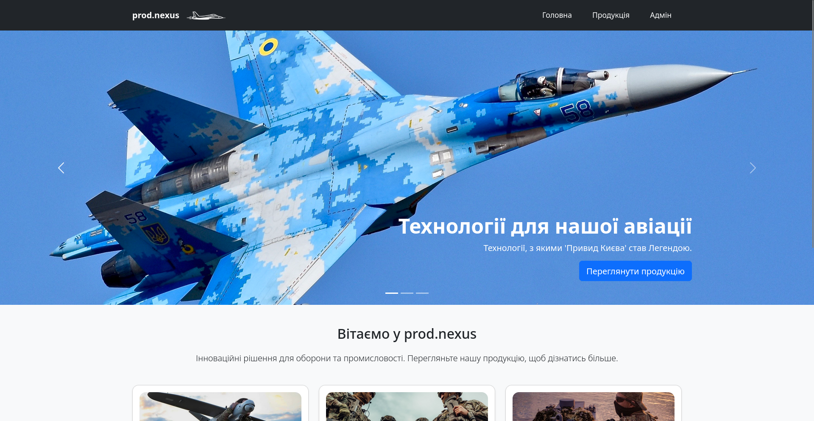

#  Defense-Industry-Website

A **Flask** web application for showcasing defense industry products, featuring an integrated **admin panel** for content management.

---

##  Screenshot



---

##  How to Run

This guide will help you **download, configure, and run** the web application locally.

###  Step 1: Clone the Repository

Clone the project files from GitHub to your computer:

```bash
git clone https://github.com/rxniray/Defense-Industry-Website.git
```

Navigate into the project folder:

```bash
cd Defense-Industry-Website
```

---

###  Step 2: Create and Activate a Virtual Environment

A virtual environment is used to isolate the project’s dependencies.

**Create the environment:**
```bash
python -m venv venv
```

**Activate it:**

For **Windows**:
```bash
.\env\Scripts\activate
```

For **macOS / Linux**:
```bash
source venv/bin/activate
```

Once activated, you will see the `(venv)` prefix in your terminal.

---

### 🔹 Step 3: Install Dependencies

Install the required libraries listed in `requirements.txt`:

```bash
pip install -r requirements.txt
```

---

###  Step 4: Run the Application

Run the main application file:

```bash
python app.py
```

If everything is set up correctly, the terminal will display a message indicating that the server is running.

---

###  Step 5: View in Browser

Open your web browser and go to.

[http://127.0.0.1:5000](http://127.0.0.1:5000)

You should see the homepage of your website.

---

##  Additional Information

- **Database:**  
  On the first launch, the app will automatically create a `database.db` file in the `instance` folder.  
  To reset the data, simply delete this file and run `app.py` again.

- **Admin Panel Credentials:**
  ```
  Username: admin
  Password: 12345
  ```

---

##  Technologies Used

- **Python 3.x**
- **Flask**
- **SQLite**
- **HTML / CSS / JS (Bootstrap)**
- **WTForms, Flask-Login, SQLAlchemy**

---

##  License

This project is open-source and distributed under the **MIT License**.  
You are free to use, modify, and share the code with proper attribution.

---

##  Authors

**[rxniray](https://github.com/rxniray)**  
**[Futokutei](https://github.com/Qwertine11)**  

> If you have any questions or suggestions — feel free to create an *Issue* or *Pull Request* 


# UA Defense-Industry-Website

Вебдодаток на **Flask** для демонстрації продукції оборонної промисловості з інтегрованою **адмін-панеллю** для керування контентом.

---

##  Знімок екрана


---

##  Інструкція по запуску

Цей посібник допоможе вам **завантажити, налаштувати та запустити** вебдодаток локально.

###  Крок 1: Клонування репозиторію

Скопіюйте файли проєкту з GitHub на ваш комп’ютер:

```bash
git clone https://github.com/rxniray/Defense-Industry-Website.git
```

Перейдіть у папку проєкту:

```bash
cd Defense-Industry-Website
```

---

###  Крок 2: Створення та активація віртуального середовища

Віртуальне середовище потрібно, щоб ізолювати бібліотеки проєкту.

**Створення середовища:**
```bash
python -m venv venv
```

**Активація:**

Для **Windows**:
```bash
.\env\Scripts\ctivate
```

Для **macOS / Linux**:
```bash
source venv/bin/activate
```

Після активації ви побачите префікс `(venv)` у терміналі.

---

###  Крок 3: Встановлення залежностей

Встановіть необхідні бібліотеки зі списку `requirements.txt`:

```bash
pip install -r requirements.txt
```

---

###  Крок 4: Запуск додатку

Запустіть головний файл програми:

```bash
python app.py
```

Після успішного запуску в терміналі з’явиться повідомлення, що сервер працює.

---

###  Крок 5: Перегляд у браузері

Відкрийте у браузері адресу.

[http://127.0.0.1:5000](http://127.0.0.1:5000)

Ви побачите головну сторінку вашого сайту.

---

## Додаткова інформація

- **База даних:**  
  При першому запуску додаток автоматично створить файл `database.db` у папці `instance`.  
  Щоб очистити дані — видаліть цей файл і запустіть додаток знову.

- **Дані для входу в адмін-панель:**
  ```
  Логін: admin
  Пароль: 12345
  ```

---

## Використані технології

- **Python 3.x**
- **Flask**
- **SQLite**
- **HTML / CSS / JS (Bootstrap)**
- **WTForms, Flask-Login, SQLAlchemy**

---

## Ліцензія

Цей проєкт є відкритим і розповсюджується під ліцензією **MIT**.  
Ви можете вільно використовувати, змінювати та поширювати код із посиланням на автора.

---

##  Автори

**[rxniray](https://github.com/rxniray)**  
**[Futokutei](https://github.com/Qwertine11)**  

> Якщо у вас є питання або пропозиції — створіть *Issue* або *Pull Request* 
