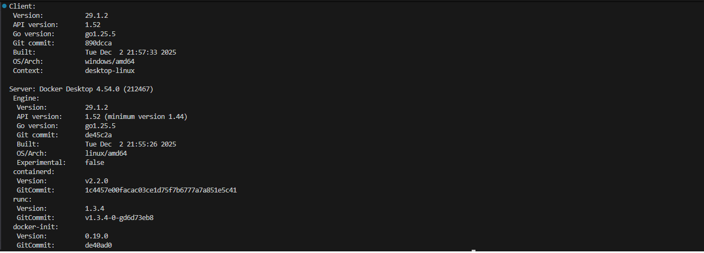
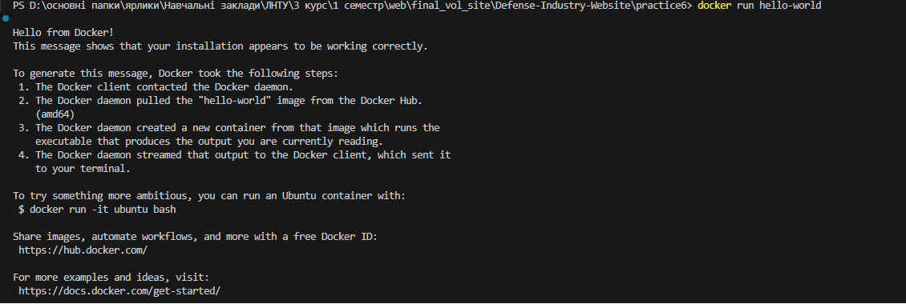
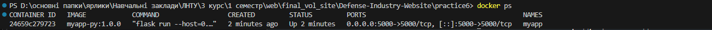
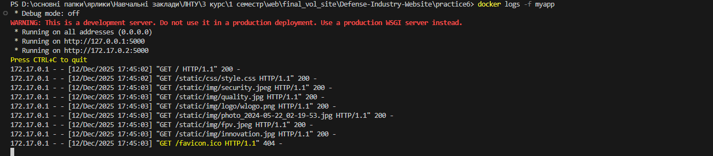
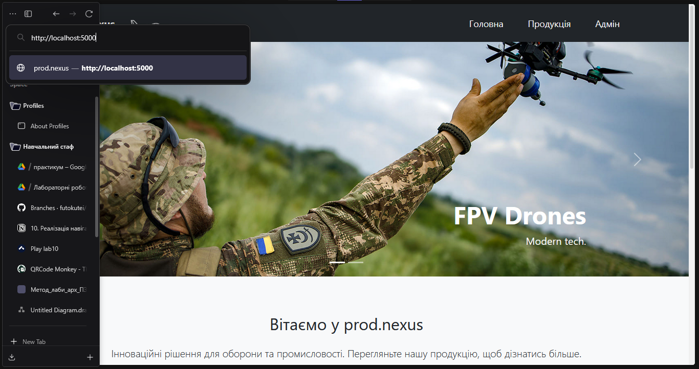
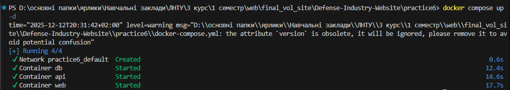
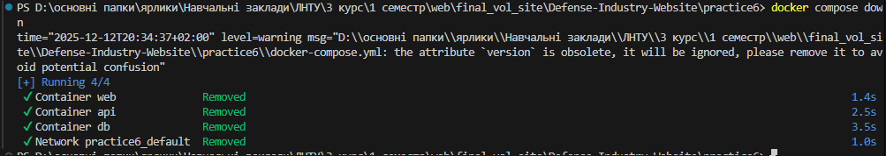
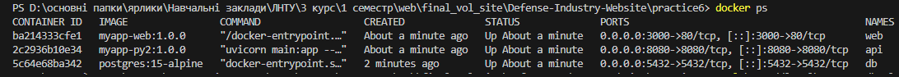
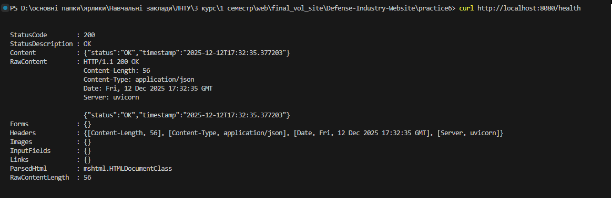

# Звіт з лабораторної роботи №6

## 1. Перевірка Docker

### Перевірка версії Docker

Log:
```
Client:
 Version:           29.1.2
 API version:       1.52
 Go version:        go1.25.5
 Git commit:        890dcca
 Built:             Tue Dec  2 21:57:33 2025
 OS/Arch:           windows/amd64
 Context:           desktop-linux

Server: Docker Desktop 4.54.0 (212467)
 Engine:
  Version:          29.1.2
  API version:      1.52 (minimum version 1.44)
  Go version:       go1.25.5
  Git commit:       de45c2a
  Built:            Tue Dec  2 21:55:26 2025
  OS/Arch:          linux/amd64
  Experimental:     false
 containerd:
  Version:          v2.2.0
  GitCommit:        1c4457e00facac03ce1d75f7b6777a7a851e5c41
 runc:
  Version:          1.3.4
  GitCommit:        v1.3.4-0-gd6d73eb8
 docker-init:
  Version:          0.19.0
  GitCommit:        de40ad0
``` 

Скріншот



### Запуск образу Hello-World

Log:
```
> docker run hello-world

Hello from Docker!
This message shows that your installation appears to be working correctly.

To generate this message, Docker took the following steps:
 1. The Docker client contacted the Docker daemon.
 2. The Docker daemon pulled the "hello-world" image from the Docker Hub.
    (amd64)
 3. The Docker daemon created a new container from that image which runs the
    executable that produces the output you are currently reading.
 4. The Docker daemon streamed that output to the Docker client, which sent it
    to your terminal.

To try something more ambitious, you can run an Ubuntu container with:
 $ docker run -it ubuntu bash

Share images, automate workflows, and more with a free Docker ID:
 https://hub.docker.com/

For more examples and ideas, visit:
 https://docs.docker.com/get-started/

```

Скріншот:

 

 ## 2. Контейнеризація свого застосунку:

 ### Команда збору образу
 ``` docker build -t myapp-py:1.0.0 . ```

 ### Команда запуску застосунку
 ``` docker run --name myapp --rm -d -p 5000:5000 myapp-py:1.0.0 ```

 ### Порт доступу
 ``` 5000:5000 ```

 ### Контейнер запущений
 

 Скріншот:
 

 ### Додаток запускається та працює на відповідному порті


 Log: 
 ```
 * Debug mode: off
WARNING: This is a development server. Do not use it in a production deployment. Use a production WSGI server instead.
 * Running on all addresses (0.0.0.0)
 * Running on http://127.0.0.1:5000
 * Running on http://172.17.0.2:5000
Press CTRL+C to quit
172.17.0.1 - - [12/Dec/2025 17:45:02] "GET / HTTP/1.1" 200 -
172.17.0.1 - - [12/Dec/2025 17:45:02] "GET /static/css/style.css HTTP/1.1" 200 -
172.17.0.1 - - [12/Dec/2025 17:45:03] "GET /static/img/security.jpeg HTTP/1.1" 200 -
172.17.0.1 - - [12/Dec/2025 17:45:03] "GET /static/img/quality.jpg HTTP/1.1" 200 -
172.17.0.1 - - [12/Dec/2025 17:45:03] "GET /static/img/logo/wlogo.png HTTP/1.1" 200 -
172.17.0.1 - - [12/Dec/2025 17:45:03] "GET /static/img/photo_2024-05-22_02-19-53.jpg HTTP/1.1" 200 -
172.17.0.1 - - [12/Dec/2025 17:45:03] "GET /static/img/fpv.jpeg HTTP/1.1" 200 -
172.17.0.1 - - [12/Dec/2025 17:45:03] "GET /static/img/innovation.jpg HTTP/1.1" 200 -
172.17.0.1 - - [12/Dec/2025 17:45:03] "GET /favicon.ico HTTP/1.1" 404 -
 ```
Log скріншот: 

  

Скріншот додатку:

 

 ## 3. Docker Compose
 
### Dockerfile frontend

[Dockerfile](./frontend/Dockerfile)

### Dockerfile backend

[Dockerfile](./backend/Dockerfile)

 ### Посилання на docker-compose.yml
 [Docker Compose](./docker-compose.yml)

### docker compose up -d : 
 
 Log: 
 ```
time="2025-12-12T20:31:42+02:00" level=warning msg="D:\\основні папки\\ярлики\\Навчальні заклади\\ЛНТУ\\3 курс\\1 семестр\\web\\final_vol_site\\Defense-Industry-Website\\practice6\\docker-compose.yml: the attribute `version` is obsolete, it will be ignored, please remove it to avoid potential confusion"
[+] Running 4/4
 ✔ Network practice6_default  Created                                                                                                  0.6s 
 ✔ Container db               Started                                                                                                 12.4s 
 ✔ Container api              Started                                                                                                 14.6s 
 ✔ Container web              Started                                                                                                 17.7s 
 ```

Скріншот: 



### docker compose down : 
 ```
 time="2025-12-12T20:34:37+02:00" level=warning msg="D:\\основні папки\\ярлики\\Навчальні заклади\\ЛНТУ\\3 курс\\1 семестр\\web\\final_vol_site\\Defense-Industry-Website\\practice6\\docker-compose.yml: the attribute `version` is obsolete, it will be ignored, please remove it to avoid potential confusion"
[+] Running 4/4
 ✔ Container web              Removed                                                                                                  1.4s 
 ✔ Container api              Removed                                                                                                  2.5s 
 ✔ Container db               Removed                                                                                                  3.5s 
 ✔ Network practice6_default  Removed                                                                                                  1.0s 
 ```

Скріншот:

 

### Перевірка

Сервіси запущені:



API logs:
```
INFO:     Started server process [1]
INFO:     Waiting for application startup.
INFO:     Application startup complete.
INFO:     Uvicorn running on http://0.0.0.0:8080 (Press CTRL+C to quit)
INFO:     172.18.0.1:48802 - "GET /health HTTP/1.1" 200 OK
```

Перехід на зібрану сторінку Nginx:

Logs:
```
/docker-entrypoint.sh: /docker-entrypoint.d/ is not empty, will attempt to perform configuration
/docker-entrypoint.sh: Looking for shell scripts in /docker-entrypoint.d/
/docker-entrypoint.sh: Launching /docker-entrypoint.d/10-listen-on-ipv6-by-default.sh
10-listen-on-ipv6-by-default.sh: info: Getting the checksum of /etc/nginx/conf.d/default.conf
10-listen-on-ipv6-by-default.sh: info: Enabled listen on IPv6 in /etc/nginx/conf.d/default.conf
/docker-entrypoint.sh: Sourcing /docker-entrypoint.d/15-local-resolvers.envsh
/docker-entrypoint.sh: Launching /docker-entrypoint.d/20-envsubst-on-templates.sh
/docker-entrypoint.sh: Launching /docker-entrypoint.d/30-tune-worker-processes.sh
/docker-entrypoint.sh: Configuration complete; ready for start up
2025/12/12 17:26:58 [notice] 1#1: using the "epoll" event method
2025/12/12 17:26:58 [notice] 1#1: nginx/1.29.4
2025/12/12 17:26:58 [notice] 1#1: built by gcc 15.2.0 (Alpine 15.2.0)
2025/12/12 17:26:58 [notice] 1#1: OS: Linux 6.6.87.2-microsoft-standard-WSL2
2025/12/12 17:26:58 [notice] 1#1: getrlimit(RLIMIT_NOFILE): 1048576:1048576
2025/12/12 17:26:58 [notice] 1#1: start worker processes
2025/12/12 17:26:58 [notice] 1#1: start worker process 31
2025/12/12 17:26:58 [notice] 1#1: start worker process 32
172.18.0.1 - - [12/Dec/2025:17:27:09 +0000] "GET / HTTP/1.1" 200 190 "-" "Mozilla/5.0 (Windows NT 10.0; Win64; x64; rv:146.0) Gecko/20100101 Firefox/146.0" "-"2025/12/12 17:27:10 [error] 31#31: *1 open() "/usr/share/nginx/html/favicon.ico" failed (2: No such file or directory), client: 172.18.0.1, server: localhost, request: "GET 
/favicon.ico HTTP/1.1", host: "localhost:3000", referrer: "http://localhost:3000/"
172.18.0.1 - - [12/Dec/2025:17:27:10 +0000] "GET /favicon.ico HTTP/1.1" 404 153 "http://localhost:3000/" "Mozilla/5.0 (Windows NT 10.0; Win64; x64; rv:146.0) Gecko/20100101 Firefox/146.0" "-"
172.18.0.1 - - [12/Dec/2025:17:31:14 +0000] "GET / HTTP/1.1" 200 190 "-" "Mozilla/5.0 (Windows NT 10.0; Win64; x64; rv:146.0) Gecko/20100101 Firefox/146.0" "-"       
2025/12/12 17:31:14 [error] 32#32: *2 open() "/usr/share/nginx/html/favicon.ico" failed (2: No such file or directory), client: 172.18.0.1, server: localhost, request: "GET /favicon.ico HTTP/1.1", host: "localhost:3000", referrer: "http://localhost:3000/"
172.18.0.1 - - [12/Dec/2025:17:31:14 +0000] "GET /favicon.ico HTTP/1.1" 404 153 "http://localhost:3000/" "Mozilla/5.0 (Windows NT 10.0; Win64; x64; rv:146.0) Gecko/20100101 Firefox/146.0" "-"
```
Скріншот:


Перевірка API:

Скріншот:
